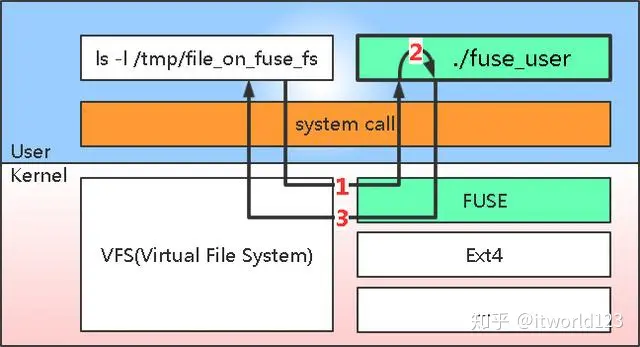

# MOS

*A minimalist file system implementation based on FUSE*

 

## Introduction

To simply understand: FUSE implements a callback for file system access. FUSE is divided into two parts: kernel-mode modules and user-mode libraries. Among them, the user-mode library provides interfaces for program development, which are also the interfaces we use during actual development. We register the request processing function into FUSE through these interfaces. The kernel-mode module is the implementation of specific data processing. It intercepts file access requests and then calls functions registered in user mode for processing.

## Reference
- [IBM: Develop your own filesystem with FUSE](http://www.cs.williams.edu/~jannen/teaching/s19/cs333/readings/FUSE/IBM_l-fuse.pdf)
- [FUSE - The Linux Kernel documentation](https://www.kernel.org/doc/html/latest/filesystems/fuse.html)
- [ArchWiki: FUSE](https://wiki.archlinux.org/title/FUSE)
- [libfuse API documentation](http://libfuse.github.io/doxygen/)
- BBFS by Joseph J. Pfeiffer, Jr., Ph.D. 

## Build
> This project is built using [xmake](https://xmake.io)

- Build: `xmake build`
- Instal: `xmake install`

## Usage

Mount a MOS filesystem by running the command `mos` (in general, a FUSE filesystem is implemented by a program, and you mount it by running that program): `mos rootdir mountdir`
   > The root directory (which contains the actual directory data) and the mount directory. 

Every time you perform any file operation in mountdir, the operation (and a whole bunch of both relevant and irrelevant stuff) gets logged to a new file in the current working directory called `mos.log`

## LICENSE

Copyright (C) 2023 Muqiu Han

This program is free software: you can redistribute it and/or modify
it under the terms of the GNU General Public License as published by
the Free Software Foundation, either version 3 of the License, or
(at your option) any later version.

This program is distributed in the hope that it will be useful,
but WITHOUT ANY WARRANTY; without even the implied warranty of
MERCHANTABILITY or FITNESS FOR A PARTICULAR PURPOSE.  See the
GNU General Public License for more details.

You should have received a copy of the GNU General Public License
along with this program.  If not, see <https://www.gnu.org/licenses/>.